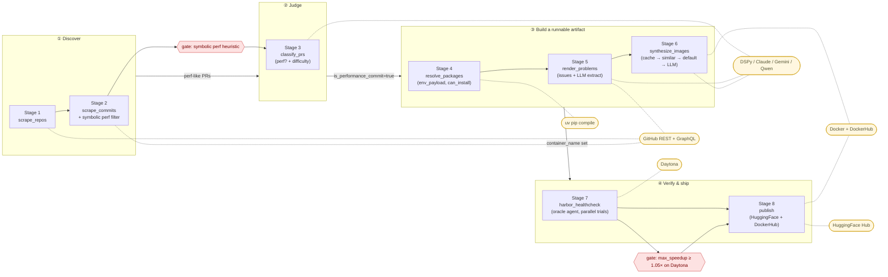

# fc-data Workflow — design notes for the phased pipeline

This document is the long-form companion to **Variation B** in `FLOWCHART.md`
(reproduced below). It exists to answer, for someone who has never seen the
codebase: *why is this pipeline structured the way it is, and not some other
way?* Most of the rationale is not in the code — it's in the FormulaCode
paper (`formulacode-paper/analysis/paper/sections/dataset/construction.tex`
and `appendix/dataset.tex`) and in operational decisions made over the
project's lifetime. We pull both together here.

---

## 0. Top-level rationale: why phases at all?

The eight CLI stages are an *operational* decomposition (each is a
resumable, separately-scheduled `fc-data --stage N` job). The four phases
are a *conceptual* decomposition that maps onto how the paper itself
narrates dataset construction. The paper (§3.1, `construction.tex`) groups
the work into exactly four stages:

> The dataset creation pipeline comprises four broad stages: (1) crawl
> GitHub repositories with high-quality expert-defined performance
> workloads, (2) filter out all candidate pull requests using rule-based
> and LLM-based attribute filters where the primary intent of merging the
> PR was not performance related, (3) synthesize an environment building
> script so that the terminal interface tools function, (4) Filter all
> candidate PRs that do not show statistically significant improvement in
> performance workloads.

Variation B mirrors that grouping 1:1, then exposes the implementation
substages inside each phase. The split between *paper stage* and *code
stage* matters because:

- **Paper stage = "what is this for?"** Each phase corresponds to one
  *kind of evidence* about a PR (does it exist, is it perf, can it be
  built, does it actually speed things up).
- **Code stage = "what is this run as?"** Each stage is a unit of resumable
  work with its own concurrency knob, table writes, and failure logging.
  Splitting `resolve_packages`, `render_problems`, and `synthesize_images`
  apart (instead of bundling them as the paper's "stage 3") is a
  *practical* decision: each one can fail or be re-run independently,
  each touches a different external service, and each has different
  per-item cost (uv compile is seconds; LLM synthesis is dollars).

The two gates on the diagram (the diamonds) are the only two places where
the pipeline genuinely *throws PRs away* on quality grounds. Everything
else either drops on hard errors (couldn't fetch, couldn't build) or
defers (rate-limited, retry later). Calling the gates out visually is the
single most important thing the diagram does.

---

## 1. Phase ① — Discover

**What.** Find every Python repository that has a working ASV benchmark
suite, then scrape every PR they've merged in the target window.

**Stages.** `scrape_repos` (1) and `scrape_commits` (2).

**Why a separate phase.** Discovery is the only phase that operates on
*the public GitHub population* rather than on rows in our own DB. It is
therefore the only phase whose throughput is bounded by GitHub's rate
limits rather than by our compute. Operationally we run it monthly to
pick up new PRs (`fc-data --start-date 2026-01-01 --end-date 2026-01-31`);
it should be cheap and idempotent.

**How.**
- *Stage 1:* the production discovery path is a CommonSQL query against
  the [GitHub Public Dataset on BigQuery](https://console.cloud.google.com/marketplace/product/github/github-repos)
  that filters for `asv.conf.json` presence, ≥ `min_stars` (paper:
  `\minStars{}`; code default 500), non-fork, recent activity, Python
  3.8+. The paper notes this query runs in ~48 seconds and costs $9.4.
  The code also supports a fallback path through the GitHub Search API
  (slower, rate-limited, same result set). Outputs land in
  `repositories`.
- *Stage 2:* for each row in `repositories`, paginate merged PRs via the
  GitHub GraphQL API (`paginate_merged_prs`), fetch per-PR file changes
  and the unified diff via REST, and run a regex/heuristic
  `symbolic_compliance()` that flags PRs whose commit message contains
  performance-positive keywords (`speed`, `optimize`, `vectorize`, etc.)
  and avoids negative ones (`revert`, `bump version`, `fix typo`). Also
  drops PRs that touch only `tests/`, `docs/`, packaging, or that exceed
  size limits (>500 files, >80k LOC, >64k tokens of patch). Outputs
  populate `pull_requests` and the boolean
  `is_performance_commit_symbolic`.

**Why the symbolic gate is here, not later.** The paper is explicit that
this is a cost-control measure: the LLM classifier in phase ② is
expensive, so we do the cheap regex pre-filter first and only spend
LLM tokens on PRs that have at least a *prima facie* perf signal. The
paper also notes the gate is intentionally lossy on the *negative* side
(filters away non-perf), and intentionally permissive on the *positive*
side (anything ambiguous is kept and forwarded to the LLM). This recall-
over-precision bias is repeated in stage 3.

**External services.** GitHub REST + GraphQL only. No LLM in this phase.

**Where the data lands.** `repositories`, `pull_requests` (with patch,
file_changes, is_performance_commit_symbolic).

**Failure mode.** GitHub rate limit. The pipeline implements `DATASMITH_RL_*`
backoff knobs (see CLAUDE.md). We tolerate partial scrapes — the next
monthly run picks up what was missed.

---

## 2. Phase ② — Judge

**What.** For each symbolically-flagged PR, decide whether it is *bona
fide* a performance optimization, and if so, label it with an
optimization category and an estimated difficulty.

**Stages.** `classify_prs` (3) only.

**Why a separate phase.** This is the first phase that costs LLM tokens
per item, and it is the first phase whose decisions are *semantic*
rather than *structural*. Splitting it from discovery means we can
re-run classification (e.g. when we swap LLMs or refine prompts) without
re-scraping GitHub.

**How.**
- Reads PRs where `is_performance_commit_symbolic=True` and either
  `is_performance_commit IS NULL` or `--force` was passed.
- Runs DSPy's `ProblemClassifier.classify(description, patch,
  file_change_summary)` to get a yes/no on perf.
- If yes, runs a second DSPy pass (`ClassifyJudge.classify`) for
  category (13-class taxonomy from the paper: *Cache and Reuse*, *Use
  Better Algorithm*, *Micro Optimizations*, *Use Lower Level System*,
  …) and difficulty (Easy / Medium / Hard).
- Updates `pull_requests` with `is_performance_commit`,
  `classification`, `difficulty`. Concurrent fan-out at N=5.

**Why recall over precision.** Paper §A.2.3 (`appendix/dataset.tex`,
`\subsubsection{Performance Intent Filtering}`):

> We explicitly prioritize recall over precision. The prompt is configured
> to lean towards a "YES" classification in ambiguous cases. This design
> choice is deliberate, as false positives will be symbolically verified
> in the subsequent benchmark execution stage, and discarded if they
> yield no measurable speedup.

This is the load-bearing design decision for the entire pipeline. The
final speedup gate in phase ④ is *the* arbiter of truth, so every
upstream filter is allowed to be loose. It is much cheaper to over-include
here and have a PR discarded after Harbor measures no speedup than it is
to under-include and miss a real optimization that will never surface
again. This single principle explains why the pipeline funnels so
aggressively: the upstream sieves are deliberately coarse because the
downstream sieve is precise.

**Why local LLM by default.** Paper §A.2: we use a locally-served
`openai/gpt-oss-120b` (vLLM, exposed via the LiteLLM proxy at
`https://model.formulacode.org`) for classification and extraction tasks
because they are high-volume, low-complexity. Frontier models are reserved
for build script synthesis (phase ③).

**External services.** DSPy → local vLLM (`gpt-oss-120b`).

**Where the data lands.** Three new columns on `pull_requests`. No new
table — the classification is small enough to inline.

---

## 3. Phase ③ — Build a runnable artifact

This phase transforms a *labelled PR* into a *thing we can actually run*.
It is the longest phase, the most expensive, and the only one whose
internal substages have a strict ordering: env → context → container.

**Stages.** `resolve_packages` (4), `render_problems` (5),
`synthesize_images` (6).

**Why a separate phase.** Everything before this is metadata. Everything
after this requires an executable artifact (a Docker image with the
package built from source). This phase exists to bridge that gap, and
the bridge is hard — paper §3.1.3 enumerates the reasons:

> automatically building such development copies proves to be a
> non-trivial task for three reasons. (1) Many scientific packages
> require complex tool interactions, which necessitate a bespoke build
> process. (2) The build process evolves significantly as a project
> matures. (3) The documentation for building packages tends to be
> extremely fragmented…

The three substages are an attempt to break the bridge into pieces that
fail loudly and independently.

### 3a. `resolve_packages` (stage 4) — "do the deps even resolve?"

**What.** Check out each PR's merge commit, parse `pyproject.toml` /
`setup.py` / `setup.cfg`, run `uv pip compile` to resolve a fully-pinned
`env_payload`, record success/failure in `packages`.

**Why first.** The paper calls this the "Build Environment" filter and
puts it in stage 2 (rule-based filtering); in code it's a separate stage
because it's compute-intensive (paper: ~13 hours parallelized) and we
want to checkpoint its output. If `can_install=False`, all downstream
stages skip the PR — there is no point synthesizing a build script for a
PR whose deps can't even resolve.

**Why uv.** Paper §A.2.2: uv is fast enough that pinning every commit's
dep set in 13 hours is feasible. With `pip-tools` it would take days.

**Concurrency.** N=16 (the highest in the pipeline) because each item is
I/O-heavy and externally rate-limited only by PyPI.

**Output.** `packages.{python_version, env_payload, build_commands,
install_commands, can_install}`. The `env_payload` is later baked into
the Dockerfile as a pinned `requirements.txt`-equivalent — this is
critical for reproducibility (paper insists on building from source for
performance accuracy, but the build environment must be deterministic).

### 3b. `render_problems` (stage 5) — "what is the agent being asked to optimize?"

**What.** Build a self-contained problem statement for the PR by
aggregating the PR body + linked issues, then asking an LLM to extract
the *initial observation*, *triage attempts*, *solution overview*, and
*solution observations* from the PR body. Render the result through a
Jinja2 template. This is the text a downstream agent (Harbor's oracle,
or a benchmark contestant) will actually read.

**Why this is hard enough to be its own stage.** Paper §A.2.4:

> while an issue provides the initial observed performance regression or
> bottleneck, [issues] frequently bundle multiple optimization
> directions that are implemented across several pull requests. As a
> result, a problem statement derived only from the issue can
> under-specify the problem statement's starting state, leading to an
> ambiguous task (an agent may optimize a different aspect than the
> original change).

So we can't just dump the issue body — we need the LLM to *narrow* the
problem to the specific direction the PR took. The extracted sentences
are symbolically verified for fidelity (high LCS ratio with the original
PR body) so the agent can't drift into hallucinated requirements.

**Hard prerequisite gate.** Stage 5 requires `packages.can_install=True`
*and* the PR must have at least one linked issue plus a non-empty body
(paper §A.2.4 "Context Filtering"). PRs without both are dropped — they
literally lack the raw material for a problem statement.

**Output.** `candidate_prs` (rich extracted components per PR) plus an
update to `pull_requests.rendered_problem` and `problem_description`.

### 3c. `synthesize_images` (stage 6) — "produce a Docker image that builds"

**What.** Generate the shell scripts (`docker_build_pkg.sh`,
`docker_build_run.sh`) that build an *editable* install of the package
inside a Docker container at the PR's merge commit, such that ASV,
pytest, and our snapshot-testing tool all run.

**Why this is the most complex stage.** It is essentially the entire
contribution of the paper's stage 3 ("Synthesizing Reproducible
Environments"). The state machine in code mirrors the paper's
"chronological retrieval + reflexive agent" design exactly:

| State | Maps to paper section |
|---|---|
| `CHECK_CACHE` | reuse-of-prior-builds (cost amortization) |
| `FIND_SIMILAR` / `TRY_SIMILAR` | "Chronological Retrieval" (10 nearest neighbours by commit date from the same repo) |
| `TRY_DEFAULT` | template-based fallback |
| `LLM_GENERATE` | "Agentic Synthesis" (10 reflexion turns max) |
| `FAIL` | drop and log |

**Why the cache → similar → default → LLM cascade.** Paper §A.2.5,
"Chronological Retrieval":

> We leverage the insight that build requirements rarely change
> drastically between adjacent commits. For a given task, we sample 10
> successful build scripts from the same repository, sourced from a
> database of successfully built tasks, sorted by commit date. We first
> attempt to build the container using the script from the nearest
> chronological neighbor. If the build or verification fails, we move to
> the next neighbor until we either find a successful build or run out
> of neighbors.

The motivation is dollar cost. Paper reports the entire build-script
synthesis effort cost \$446 at the time of writing, and explicitly says
this number would explode without the cascade because each LLM-from-scratch
synthesis is the most expensive single operation in the pipeline. This
is also why successful synthesis on one PR triggers `_enqueue_neighbors()`
in code — adding the ±60-day siblings to the queue means the cache is
maximally warm by the time those siblings are processed.

**LLM cascade.** The local `gpt-oss-120b` is tried first; failure falls
back to `claude-3-5-sonnet-20241022`. Codex / Gemini / Qwen are
additional swap-in agents in the code. Paper notes the largest models
rarely use the available tools (read repo files, parse setup.py) because
the failure logs are usually self-explanatory; smallest models (Llama
3.3 8B) use many tool turns. The 10-turn budget is hard.

**Concurrency.** N=3 worker pool (lower than other stages) because each
worker holds a Docker daemon slot and a non-trivial amount of disk for
intermediate layers. Workers share a rate-limit pause state so a 429
from the LLM provider stops everyone.

**Output.** `candidate_containers` (the synthesized scripts), an update
to `pull_requests.container_name` (the DockerHub tag), and an actual
push to DockerHub of base / repo / PR images.

**Why three image layers.** Cost again — the base image (Python +
system deps) is shared across the entire repo; the repo image (source
tree at HEAD-ish) is shared across PRs in the same repo; only the PR
image is unique. Building bottom-up with cache-on-hit means a new PR in
a known repo costs ~minutes, not ~hours.

---

## 4. Phase ④ — Verify & ship

**What.** Run the synthesized container through a real benchmark
oracle, measure the actual speedup the PR produces, and only publish
PRs that pass the speedup threshold.

**Stages.** `harbor_healthcheck` (7), `publish` (8).

**Why a separate phase.** This is the *only* phase that produces ground
truth. Everything upstream is suggestive — only Harbor on Daytona
actually times the code. Splitting verify from ship means we can
re-measure (e.g. if hardware changes invalidate prior measurements,
or if we want fresh trials) without re-publishing.

### 4a. `harbor_healthcheck` (stage 7) — measure the speedup

**What.** For each PR with a built container, hand off to Harbor (the
benchmark orchestrator) which materializes a task directory, launches
the *oracle* agent (a no-op agent that simply applies the human
expert's patch), runs ASV, and produces a `reward.json` with per-
benchmark speedups. We record one `harbor_runs` row per trial.

**Why an "oracle" agent.** This is the diagnostic question "does the
human's patch, applied in our container, actually speed things up?" If
not, our container is broken (build artifact issue) or the PR was
mislabelled (false positive from phase ②). Either way, we drop it. It
is critical that this measurement is done with the same agent
infrastructure that contestants will use, otherwise we cannot claim
the dataset is fair.

**Why two environments (`docker` vs `daytona`).** Paper §A.2.6:
measurement noise is the enemy. ASV's two-stage decision rule (Mann–
Whitney U with `p < 0.002`, or non-overlapping 99% CIs as fallback)
is conservative by design, but conservatism is meaningless if the
substrate is itself noisy. Daytona gives us a clean EC2 instance per
trial; local docker is fast but shares a host with other workloads.

> Local Docker runs are useful for iteration; only Daytona runs gate
> stage 8.

(from `CLAUDE.md`). The code records `harbor_runs.environment` so
we can tell the two apart — and stage 8 explicitly filters to
`environment='daytona'`.

**Concurrency.** Harbor's `LocalOrchestrator` handles trial parallelism
internally; we batch-submit PRs and let Harbor parallelize.
`--n-concurrent 16` for Daytona is typical.

### 4b. `publish` (stage 8) — ship

**What.** Pick PRs whose best Daytona harbor_runs row reports
`max_speedup ≥ 1.05`, serialize them to Parquet via pyarrow, push to
HuggingFace, re-push their Docker images to DockerHub, mark
`pull_requests.published_at`.

**Why the 1.05× threshold.** The paper's stage 4 statistical test
(Mann–Whitney U at p<0.002) is the *correctness* test — does the
speedup exist statistically? The 1.05× threshold is an *interestingness*
filter — the paper's premise is that LLMs should be evaluated on
*meaningful* optimizations, not noise-floor improvements. A PR that
passes Mann–Whitney with a 1.001× speedup is real but uninteresting;
including it would inflate dataset size while diluting the benchmark.

**Why publish is fail-closed.** If Harbor never ran successfully on
Daytona, the PR is *not* published — even if every upstream stage
labelled it as a great optimization. This is the design choice that
makes the FormulaCode dataset trustworthy: you cannot get into the
release without a measured speedup. The paper calls this out as the
project's central contribution over SWE-bench-style binary
pass/fail benchmarks.

---

## 5. Cross-cutting design choices

These are decisions that don't belong to any one stage but shape the
whole pipeline.

### 5.1 Supabase as the bus

There is no inter-stage messaging system. Stages communicate by writing
columns/rows that other stages read. This is by design:

- *Resumability.* A stage that crashes leaves the DB in a valid state;
  the next run picks up where the previous one left off via
  `--resume` or stage-specific filters.
- *Observability.* The dashboard (`analysis/dashboard`) reads the same
  tables the pipeline writes. Anyone can see the funnel narrowing in
  real time.
- *Independence.* Stages can be re-run, re-ordered (within phases), or
  swapped out entirely. The contract is a table schema, not a Python
  function signature.
- *Public read.* The `anon` role can read `repositories`,
  `pull_requests`, `candidate_containers`, `harbor_runs`,
  `benchmark_information` over `https://api.formulacode.org`. The
  pipeline is in effect a public dataset that happens to update itself.

The `pull_requests` table is the "spine" — it accretes a new column at
nearly every stage (`is_performance_commit_symbolic`,
`is_performance_commit`, `classification`, `difficulty`,
`rendered_problem`, `container_name`, `published_at`). Side tables
(`packages`, `candidate_prs`, `candidate_containers`, `harbor_runs`)
exist where the data is too large or too one-to-many to inline.

### 5.2 Local LLMs by default, frontier as fallback

Paper §A.2: classification, extraction, and most synthesis runs go to
`gpt-oss-120b` served by vLLM, exposed via the LiteLLM proxy
(`https://model.formulacode.org`). Only the synthesis cascade falls
back to Claude 3.5 Sonnet (and only when local models fail repeatedly).
This is partly cost (the entire dataset cost \$446 of Anthropic credits)
and partly throughput (local models have no rate limit, just a queue
depth).

### 5.3 Recall first, precision last

This is restated here because it is the single most consequential
architectural choice:

- Symbolic filter (stage 2): drop only on negative signal.
- LLM classifier (stage 3): bias toward YES on ambiguity.
- Build / synth (stages 4–6): try every fallback before giving up.
- Speedup gate (stage 7→8): the *only* hard precision filter in the
  pipeline.

Inverting this — putting precision early — would either lose real
optimizations (false negatives are unrecoverable) or duplicate work
(every precise filter has to redo the work the speedup gate already
does). The pipeline is shaped like a funnel because the only thing we
can actually trust is the ground-truth measurement at the bottom.

### 5.4 Tunable knobs go through `tokens.env`

Per `CLAUDE.md`, every operationally tunable constant is read from the
environment with a `DATASMITH_` prefix, defaulted to a literal in
Python. This matters for the pipeline because nearly every stage has
a "how aggressive should this be?" knob (rate-limit pause, neighbor
window, retry count, concurrency) and we want operators to tune
without code changes.

### 5.5 Monthly cadence

Paper §A.1: building from scratch takes ~32 hours and ~2 TB of disk.
We don't do that. The pipeline is run with a monthly date window
(`--start-date 2026-01-01 --end-date 2026-01-31`) so each invocation
processes only that month's new merged PRs. Caches (build scripts,
base images, repo images) carry over from previous months, so the
amortized per-month cost is small.

---

## 6. Where the diagram is *not* faithful

Important caveats so a reader doesn't take the diagram too literally:

- **Phase boundaries are not transactional.** A failure mid-phase
  doesn't roll back the phase. Each stage commits per-item.
- **The "external services" arrows are shared.** GitHub touches stages
  1, 2, and 5; the LLM proxy touches 3, 5, and 6. The diagram dots
  these in to show *which* stage uses *which* service, but in
  production a single LiteLLM instance fields all three.
- **Stage 6 is the only stage that pushes Docker images during the
  pipeline.** Stage 8 *re-pushes* to ensure availability, but the
  initial push happens in stage 6. The diagram simplifies this.
- **Harbor is itself a multi-component system.** "Stage 7 → Daytona"
  hides that Harbor materializes task directories, runs the oracle
  agent, parses ASV output, and aggregates trials. The diagram treats
  it as one node because the externally visible behavior — submit
  containers, get speedups — is one operation.
- **The paper's "stage 4" (statistical validation) is *inside* our
  stage 7, not our stage 8.** Mann–Whitney U is what Harbor's reward
  computation is doing under the hood; the 1.05× filter in publish is
  on top of that statistical test, not in place of it.

If you need any of those details, fall back to Variation C
(database-as-bus) in `FLOWCHART.md` or read the per-stage modules
listed in `CLAUDE.md`.

